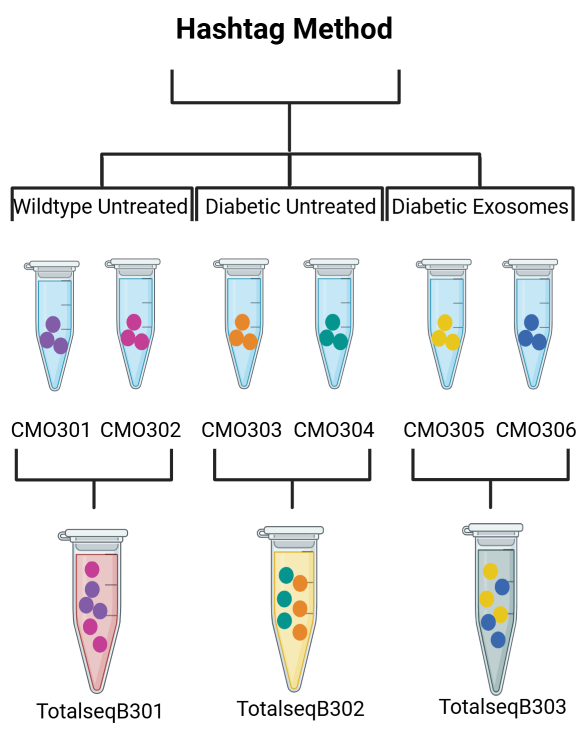

# Single Cell Analysis for Multiple Hashtags 



## Overview

This repository contains a single-cell RNA-seq analysis workflow for experiments using both lipid and antibody hashtags. The pipeline was used to assign cells to experimental phenotypes, perform clustering, identify marker genes, and compare transcriptional differences between phenotypes.

## Workflow

### 1. Create Seurat Object
`create_seurat_object.R`

- Load Cell Ranger output
- Perform QC filtering
- Normalize RNA data
- Identify variable features

### 2. Demultiplex Hashtags
`demultiplex_lipid_antibody_hashtags.R`

- Add lipid and antibody hashtag assays
- Perform CLR normalization
- Run HTODemux
- Store hashtag classifications

### 3. Assign Phenotypes
`assign_phenotypes.R`

- Combine lipid and antibody hashtag identities
- Assign cells to Phenotype 1, 2, or 3

### 4. Clustering and UMAP
`clustering_umap.R`

- PCA
- Clustering
- UMAP visualization

### 5. Marker Analysis
`marker_analysis.R`

- Identify cluster markers
- Compare phenotypes
- Generate visualization plots

### 6. GO Enrichment Analysis
`go_enrichment.R`

- Perform GO enrichment analysis
- Export enriched pathways and gene sets

## Repository Structure

```text
.
├── scripts/
│   ├── create_seurat_object.R
│   ├── demultiplex_lipid_antibody_hashtags.R
│   ├── assign_phenotypes.R
│   ├── clustering_umap.R
│   ├── marker_analysis.R
│   └── go_enrichment.R
│
├── environment.yml
└── README.md
```

## Installation

```bash
conda env create -f environment.yml
conda activate lipid_antibody_hashtag_env
```

## Notes

This workflow was developed for multiplexed single-cell RNA-seq experiments using combined lipid and antibody hashtag labeling strategies and can be adapted for similar studies.
---

### Additional Enhancements:
- **Links to Documentation**: Respective libraries or related resources:
  - [Seurat documentation](https://github.com/satijalab/seurat)
  - [Doublet Finder documentation](https://github.com/chris-mcginnis-ucsf/DoubletFinder)

